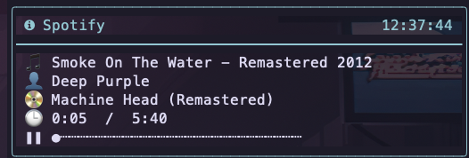

# 🎵spotipy.nvim

For Neovim users who want to have music at their fingertips.
`spotipy.nvim` is a plugin that allows you to control your Spotify account from within Neovim.


## Features

-   Display/Filter the search results with Telescope  

-   Currently playing statusline.  

-   Currently playing notification.

-   Toggle track status

-   Skip a track  

-   Add a track to queue

-   Select which device to play on  

-   Search by tracks


## Requirements

> `spotipy.nvim` is a python based plugin, using the [spotipy](https://github.com/spotipy-dev/spotipy) library to interact with the Spotify API.

-   [pynvim](https://github.com/neovim/pynvim)
-   [spotipy](https://github.com/spotipy-dev/spotipy)
-   [Telescope](https://github.com/nvim-telescope/telescope.nvim)
-   [Spotify](https://www.spotify.com/us/download)
-   [Spotify Premium](https://www.spotify.com/us/premium/)

> As `spotipy.nvim` only handles the interaction with the Spotify API, you will need a Spotify Premium account to use this plugin.
> As Spotify API does not handle the playback of the music, you will need to have the Spotify app running in the background.
> The `spotipy.nvim` plugin was tested using on linux and mac using the full version of the Spotify app, it may not work with `spotifyd`.

## Installation

### [packer](https://github.com/wbthomason/packer.nvim)
```lua
-- Lua
use {
    "AvivKehrmann/spotipy.nvim",
    requires = 'nvim-telescope/telescope.nvim',
    config = function()
    local spotipy = require("spotipy.nvim")
    spotipy.setup({
        status = {
            update_interval = 10000}
        })
    end
}
```
### [lazy.nvim](https://github.com/folke/lazy.nvim)
```lua
return {
    {
        "AvivKehrmann/spotipy.nvim",
        requires = "nvim-telescope/telescope.nvim",
        config = function()
            local spotipy = require("spotipy.nvim")
            spotipy.setup({
                status = {
                    update_interval = 10000}
            })
        end
    }
}
```

#### Notes
Decreasing the `update_interval` value means more API calls in a shorter period. Because of the Spotify API rate limiter, setting this too low can block future requests.
Besides that, keep in mind these updates are api calls, they will slow your computer down. 
Generally, i use 5000ms as the update interval, and experience no issues.

## Connecting to Spotify’s API

`spotipy.nvim` needs to connect to Spotify’s API in order to find music by
name, play tracks etc.

In order to do so please follow these steps:

1. Go to the [Spotify dashboard](https://developer.spotify.com/dashboard/applications).
1. Click `Create an app`.
    - You now can see your `Client ID` and `Client Secret`.
1. Now click `Edit Settings`.
1. Add `http://localhost:8888/callback` (if the spacific port is taken choose any port you'd like) to the Redirect URIs.
1. Scroll down and click `Save`.
1. You are now ready to authenticate with Spotify!.
1. Go back to the terminal.
1. Add the Client Id, Client Secret, and Redirect URI to your environment variables, by adding the following lines to your `.bashrc` or `.zshrc`:
    ```bash
    export SPOTIPY_CLIENT_ID='YOUR_CLIENT_ID'
    export SPOTIPY_CLIENT_SECRET='YOUR_CLIENT_SECRET'
    export SPOTIPY_REDIRECT_URI='http://localhost:'YOUR_PORT'/callback'
    ```
1. Use the `source` command to apply the changes:
    ```bash
    source ~/.bashrc
    ```
    ```bash
    source ~/.zshrc
    ```
1. Use the `SpotifyDevices` command to connect to your Spotify account.
1. A browser window will open, asking you to log in to your Spotify account.
1. After logging in, you will be redirected to a page that says `Authentication complete. You can close this tab.`
1. Now you are connected to the Spotify API and can use the `spotipy.nvim` plugin.

And now you are ready to use the `spotipy.nvim`

## Usage
`spotipy.nvim` has several commands:

### Adding a Track to the Queue
Add a song to the queue (plays it next) by specifying a track URI.
```bash
:SpotifyAdd <track_uri>
```

### Connecting to a Device
Open a menu of the devices connected to your Spotify account and select which one to play on.
```bash
:SpotifyDevices
```

### Playing a Song
Play a song by providing its URI.
```bash
:SpotifyPlay <track_uri>
```

### Controlling Playback
Control the playback with options to skip or go back a song.
```bash
:SpotifyPlayback -n/next      # Skip to the next song
:SpotifyPlayback -p/prev      # Go back to the previous song
```

### Displaying the Playlist
Show the next 20 songs in the queue.
```bash
:SpotifyPlaylist
```

### Searching for a Track
Search for a song by providing its name and display the top 20 results.
```bash
:SpotifySearch <song_name>
```

### Checking Current Status
Uses the `vim.notify` API to display the current Spotify status, including song name, album name, artist name, and duration. If no song is playing, an appropriate message will be shown.
Recommented usage with [nvim.notify](https://github.com/rcarriga/nvim-notify) plugin.
```bash
:SpotifyStatus
```

### Toggling Playback
Toggle the current playback on or off based on the current state.
```bash
:SpotifyToggle
```

### Default keymaps
The following keymaps are set by default, notice they all need to be prefixed with youre leader key.:
| mode | key | Description |
|---|---|---|
| normal| <leader>ms | search for songs
| normal | <leader>mt | toggle playback
| normal | <leader>ml | show Playlist
| normal | <leader>mn | skip song
| normal | <leader>mp | go back to the previous song
| normal | <leader>md | show devices
| normal | <leader>mm | show current status

### Override keymaps
The default keymaps are set during the spotipy.nvim setup function.
Make sure to call the setup function before setting your own keymaps.
You can override the default keymaps by settings your own in the following way:
```lua
vim.api.nvim_set_keymap("n", "<leader>mt", ":SpotifyToggle<CR>", { noremap = true, silent = true })
vim.api.nvim_set_keymap("n", "<leader>ml", ":SpotifyPlaylist<CR>", { noremap = true, silent = true })
vim.api.nvim_set_keymap("n", "<leader>mn", ":SpotifyPlayback -n<CR>", { noremap = true, silent = true })
vim.api.nvim_set_keymap("n", "<leader>mp", ":SpotifyPlayback -p<CR>", { noremap = true, silent = true })
vim.api.nvim_set_keymap("n", "<leader>mm", ":SpotifyStatus<CR>", { noremap = true, silent = true })
vim.api.nvim_set_keymap("n", "<leader>md", ":SpotifyDevices<CR>", { noremap = true, silent = true })
vim.api.nvim_set_keymap("n", "<leader>ms", ":lua require('neovim-spotify').search()<CR>", { noremap = true, silent = true })
```

### Statusline
You can display what's currently playing on your status bar.
The example below shows how to show it on [lualine](https://github.com/nvim-lualine/lualine.nvim),
although the configuration should be quite similar on other statusline plugins:
```lua
local status = require"spotipy.nvim".status

status:start()

require('lualine').setup {
    sections = {
        lualine_x = {
            status.listen
        }
    }
}
```


### Notifications
You can display the current status and many other notifications using the [nvim.notify](https://github.com/rcarriga/nvim-notify) plugin.
```lua

```


